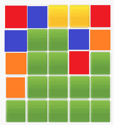

# Workle

[Link to Live Site Here]()

The purpose of Workle is to allow users to track their day to day emotions and for them to visually see how they feel over a period of time. It is a tool which users can use to help track and manage stress ....

Workle is a site where users can go in order to track their emotions on a daily basis. Everyday users are able to chose a colour which represents their overall emotion/feeling for the day (e.g. Green = Happy / Red = Angry) and add a comment describing how their day was and any potential reasons for feeling this way.

By entering how they feel every day users are able to visually see a grid displaying all prior days and how they felt. Over time this grid will build out and be a visual represntation of the users day to day emotions helping them to monitor stress levels and overall mantal wellbeing. 

Workle also has a page dedicated to explaining and helping users understand different feelings (e.g. anxiety, depression and stress) and provides useful resources which they can use to help deal with them. 

And example of how the grid will look after serveral uses can be seen below:



---


---

# User Experience (UX) 

* ## Vision
    The vision for Workle is to be an application which users use daily helping them to understand and visual their mental wellbeing over a period of time. 

* ## Aims
    To provide users an application they can use in order to help track and manage their emotions with the aim to help make users aware of how they feel and allow them to implement solutions to improve their overall wellbeing.

* ## Target Audience
    Workle is for everyone! No matter your age keeping track of your mental wellbeing is vital to a successful and fufilling life, so whether your a teenager dealing with school stress or and adult trying to manage your work/life balance Workle is for you. 

* ## User Stories

1. As a user, I can add my colour and a comment so that I can complete the daily enty

2. As a user, I can submit my entry for the day, so that it will be added to my grid

3. As a user, I can view additional information, so I can learn more about Mental Health and Wellbeing

4. As a user, I can navigate the website with ease, so I am able to find everything

5. ...

6. ...

* ## Development Method 

When creating Workle we took an [Agile](https://en.wikipedia.org/wiki/Agile_software_development) Approach. That is, taking an iterative approach to software development helping us to deliver value to the user faster. As a team we focused on collaboration, less documentation, continous delivery and adaptive planning in order to ensure all User Stories were met.

* ## Scope

Features to be included:

* The landing page of Workle is where users are able to add their daily entries to their emotion grid as which includes adding the colour as well as the comment. Once this is done, users can submit this entry and their data will be added to the grid allowing them to see an up-to-date version.

* The second page of the site, will be a informative page where users are able to learn more about mental health, how to manage stress and tips on how to avoid burnout. The page will include useful information with the aim to further expand their knowledge on these areas, as well as include links to sites where they can learn more.

### Workle Wireframes:


## Design 


# Features 

Here describes the main features of the website and what the user can expect when viewing ~

## Existing Features:


## Future Features:


# Technologies 
## Languages Used

- [HTML](https://www.python.org/) - HyperText Markup Language is the standard markup language for documents designed to be displayed in a web browser.

- [CSS](https://en.wikipedia.org/wiki/CSS) - Cascading Style Sheets is a style sheet language used for describing the presentation of a document writtin in a markup language such at HTML.

- [JavaScript](https://en.wikipedia.org/wiki/JavaScript) - JavaScript is a scripting language that allows you to implement complex features on web pages.

- We used GitHub [Project Board](https://github.com/RiyadhKh4n/team-8/projects/2) to keep track of all the tasks necessary in order to build this application

## Frameworks, Libraries & Programs Used:

1. [GitPod](https://www.gitpod.io/):
    * GitPod was the IDE used to create the site

2. [Git](https://git-scm.com/):
    * Git was used for version control by utilizing the Gitpod terminal to commit to Git and Push to GitHub.

3. [GitHub](https://github.com/):
    * GitHub is used to store the projects code after being pushed from Git.

4. [Google Developer Tools](https://developer.chrome.com/docs/devtools/)
    * Used to test the program throughout development

5. [Heroku](https://dashboard.heroku.com/login)
    * Used to Deploy the Project

7. [Balsamiq](https://balsamiq.com/)
    * Used to design the wireframes

8. [AmIResponsive](http://ami.responsivedesign.is/)
    * To generate the image at the beginning of the README

9. [TinyPNG](https://tinypng.com/)
    * This was used to compress all images used in the README.md

10. [favicon.cc](https://www.favicon.cc/)
    * Used to generate the favicon address from the hosted site

11. [Flask](https://flask.palletsprojects.com/en/2.0.x/)
    * Flask is a micro web framework writtin in Python

# Testing 

All testing for Workle can be seen in [TESTING.md](TESTING.md)

[Link To Testing.md](TESTING.md)
   
# Deployment 

## Making a Local Clone

1. Log in to GitHub and locate the [GitHub Repository]()
2. Under the repository name, click "Clone or download".
3. To clone the repository using HTTPS, under "Clone with HTTPS", copy the link.
4. Open Git Bash
5. Change the current working directory to the location where you want the cloned directory to be made.
6. Type `git clone`, and then paste the URL you copied in Step 3.

    $ `git clone ` 

7. Press Enter. Your local clone will be created. 

```shell
$ git clone 
> Cloning into `CI-Clone`...
> remote: Counting objects: 10, done.
> remote: Compressing objects: 100% (8/8), done.
> remove: Total 10 (delta 1), reused 10 (delta 1)
> Unpacking objects: 100% (10/10), done.
```

Alternatively, if using Gitpod, you can click below to create your own workspace using this repository.

[]()


# Credits 


## Code

### Acknowledgements


